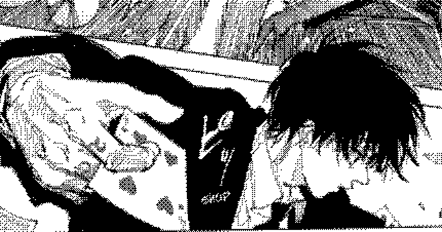
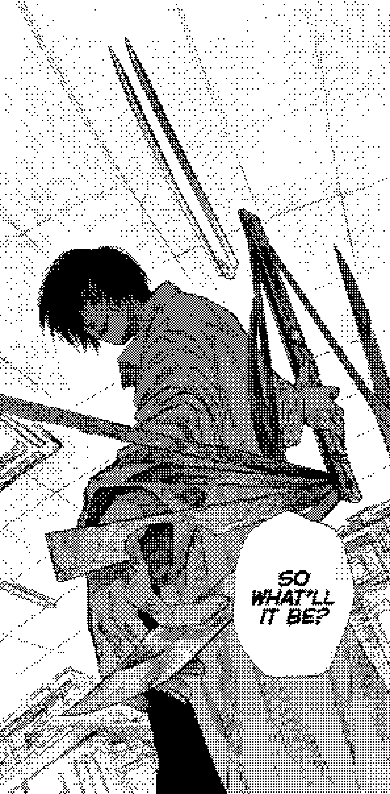

  <!-- Banner do Topo Pontilhado -->
  

  <h1>Olá 👋, eu sou VH</h1>

  <h3>Desenvolvedor Full Stack Júnior & Autodidact</h3>

  
<i>"Adaptability is the ultimate weapon."</i>

  
Construindo aplicações modernas com foco em backend, APIs eficientes e arquitetura limpa.

---

## 🃏 Sobre mim

<table>
  <tr>
    <td width="60%" valign="top">
       
      <blockquote><b>"Às vezes, a melhor solução é a que ninguém vê chegando."</b></blockquote>
       
      
Desenvolvedor focado na construção de sistemas eficientes, APIs escaláveis e interfaces funcionais. Movido por curiosidade e aprendizado contínuo, aplico uma abordagem analítica para resolver problemas e transformar requisitos em código limpo.

      <ul>
        <li>🎯 <b>Foco Atual:</b> Arquitetura de APIs RESTful, microsserviços e integração Full Stack.</li>
        <li>💻 <b>Stack Principal:</b> Python (FastAPI), JavaScript (Node/Frontend) e bancos de dados.</li>
        <li>🧠 <b>Perfil:</b> Autodidata e analítico. Quando surge um desafio desconhecido, pesquiso e testo até dominar a solução.</li>
        <li>⚡ <b>Filosofia:</b> Código limpo, execução precisa e evolução constante a cada commit.</li>
      </ul>
    </td>
    <td width="40%" align="center" valign="middle">
      <!-- Imagem Lateral Pontilhada -->
      
    </td>
  </tr>
</table>

---

## 🛠️ Arsenal de Tecnologia

  
  
  
  
  
  
  

---

## 📬 Conecte-se comigo

  

