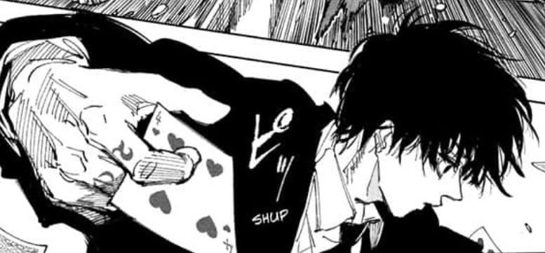
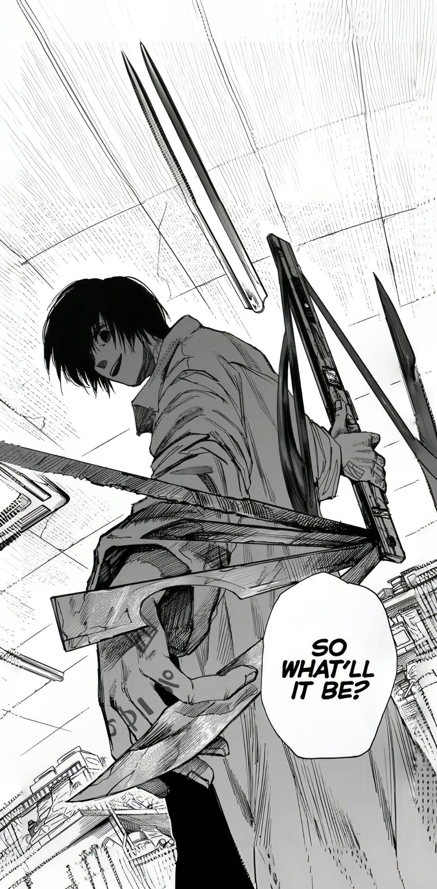

  <!-- Banner do Topo -->
  

    

  <h1>Hi 👋, I'm VH</h1>

  <h3>Junior Full Stack Developer & Autodidact</h3>

  

    <i>"Adaptability is the ultimate weapon."</i>
  

  
  

    Construindo aplicações modernas com foco em backend, APIs eficientes e arquitetura limpa.
  

---

## 🃏 About Me

<table>
  <tr>
    <td width="65%" valign="top">
       
      <blockquote><b>"Às vezes, a melhor solução é a que ninguém vê chegando."</b></blockquote>
       
      <ul>
        <li><b>Perfil:</b> Desenvolvedor Júnior autodidata. Não espero respostas prontas: quando surge um problema ou tecnologia desconhecida, vou atrás até dominar.</li>
        <li><b>Foco:</b> Ecossistema Full Stack, projetando soluções com <b>Python</b>, APIs com <b>FastAPI</b> e criando interfaces responsivas no Frontend.</li>
        <li><b>Filosofia:</b> Aprender na prática, testar limites e evoluir a cada commit.</li>
      </ul>
    </td>
    <td width="35%" align="center" valign="middle">
      <!-- Imagem Lateral -->
      
    </td>
  </tr>
</table>

---

## 🛠️ Tech Arsenal

  
  
  
  
  
  
  

---

## 📬 Connect With Me

  

